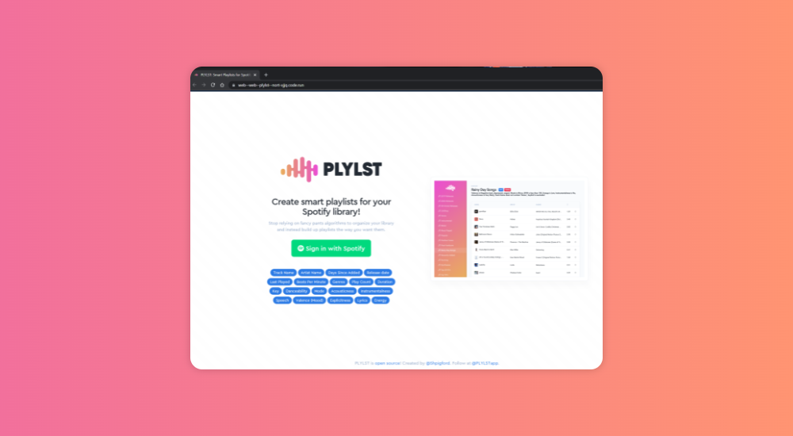

## Deploying Plylst on Northflank



[Plylst deployment tweet](https://twitter.com/Shpigford/status/1464262400362831876)

"Won't be releasing it as a public service again unless I can figure out A) how to get server costs down from $300/mo to ~$50/mo"

Below is a setup on Northflank costing ~ $55.

To run the script you need a [Northflank API token](https://northflank.com/docs/v1/application/secure/manage-api-tokens) set as an environment variable `NF_TOKEN` and `spotify_key` & `spotify_secret` via [Spotify API keys](https://developer.spotify.com/dashboard)

#### Getting started 
``` yarn install```

```NF_TOKEN=value spotify_key=value spotify_secret=value yarn start```

The index.js file makes a number of API requests to [Northflank](https://northflank.com) to create a project called [Plylst](https://github.com/Shpigford/plylst
). It creates all the required infrastructure, builds, databases and secrets/connection strings.
The steps below can also be followed in the UI.

#### Plylst consists of:
- 1 public git repository
- 1 ruby web service running on port 8080
- 1 ruby sidekiq background worker
- 1 postgres database
- 1 redis database

The web and worker share the same codebase. The codebase can be built with a heroku/buildpacks:20 with ruby auto-detected.

#### On Northflank I can configure:

- A project in US Central, or for Europe West - over-ride environment with `NF_REGION=europe-west`
- A build service building from https://github.com/Shpigford/plylst ($1/pm)
    - Initial builds take 4 minutes
    - Subsequent builds take 1min30 with caching enabled
- 2 deployment services
    - Web: A deployment service auto deploying master branch from the builder with port 8080 publicly exposed ($16/pm)
    - Worker: A deployment service auto deploying master branch from the builder with CMD over-ride: `bundle exec sidekiq -e ${RAILS_ENV:-production} -C config/sidekiq.yml` ($16/pm)
- 2 addons:
   - Redis: Managed Redis ($4/pm)
   - Postgres: Managed Postgres ($10-16/pm) with 8GB $0.3 per GB from there
- 1 manual job:
   - Migrations: A manually triggered job to run migrations when required and on initialisation with CMD over-ride `rake --trace db:migrate`  ($1/pm)
- 1 secret group
   - Securely store and inject environment variables with your Spotify developer keys and inherit your Redis and Postgres connections strings automatically
